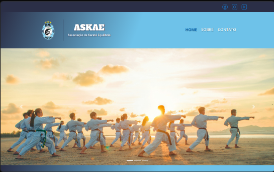

<h1 align="center" >ASKAE - Associação de Karatê e Equilíbrio</h1>

    

<h2 id="started">Descrição</h2>
Essa Landing Page foi um dos meus primeiros projetos a serem desenvolvidos, a ASKAE é uma acadêmia de karatê onde passei uma boa parte da minha adolescência, então quando iniciei meus estudos no mundo do desenvolvimento
web, esse foi o primeiro projeto que me veio em mente, construir uma página para minha equipe, desenvolvi logo no começo dos meus estudos de **HTML**, **CSS** e **JavaScript**, não entendia nem sobre **Node** ou o que era package.json, 
muito utilizado nos meus atuais projetos frontend. Bem, essa landing page havia ficado pelo meio do caminho, sem nenhuma funcionalidade, ou mesmo responsividade...

Recentemente tomei consciência que para ter um portfólio apresentável, eu deveria finalizar os meus projetos inacabados, e como a landing page da ASKAE foi um dos meus primeiros projetos, resolvi começar
por ele para finalizar, estou aplicando as melhores práticas de programação que venho aprendendo nos últimos tempos, tais como **mobile first**, ou seja, uma responsividade para que a página não se desconfigure todas
ao ser ajustada a largura da tela; optei por manter o desenvolvimento em **vanila.js** (só o básico, **HTML**, **CSS**, **JS** e **Bootstrap** que tinha desde o começo) sem usar **React** ou mesmo **Angular**, para por em prática meu dominio das tecnologias mais básicas, mas 
que é a base de toda página na web; adicionei o package.json pois pretendia fazer o deploy da página e por no meu portfólio, porém contendo apenas configurações mais básica, para o build e deploy.

Desenvolvido em:

- Vanilla.JS
- Bootstrap
  

<h2>Getting Started</h2>

    npm install

First, run the development server:

    npm run dev
    # or
    yarn dev
    # or
    pnpm dev
    # or
    bun dev

<h2>Author</h2>
<table>
  <tr>
    <td align="center">
      <a href="#">
         
        
          <b>Andre Alves Pereira</b>
        
      </a>
    </td>
</table>

<h2>Project status</h2>

This project is still under development, that is, if you find a bug and want to contribute, you can report the problem found and as soon as possible I will make the necessary corrections, in addition, I am also making some improvements, so in the future the projects may contain new features.
